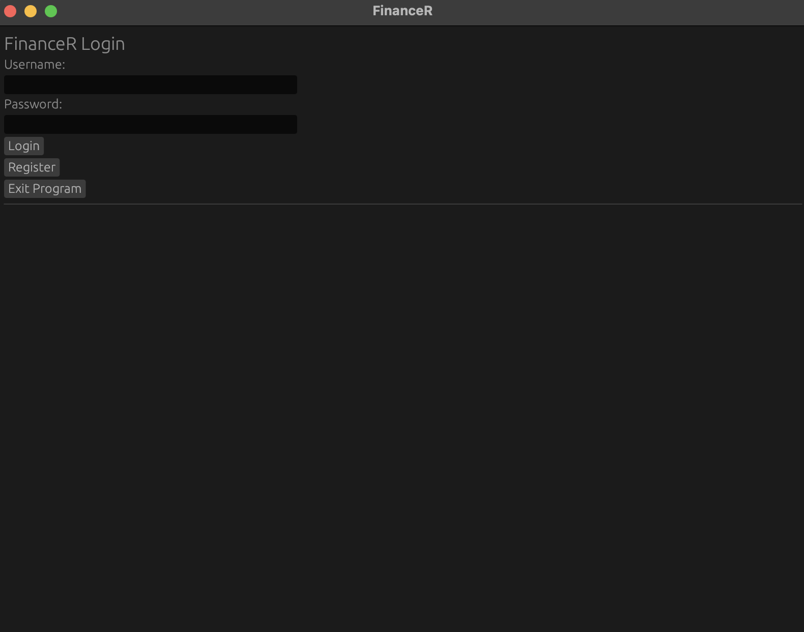
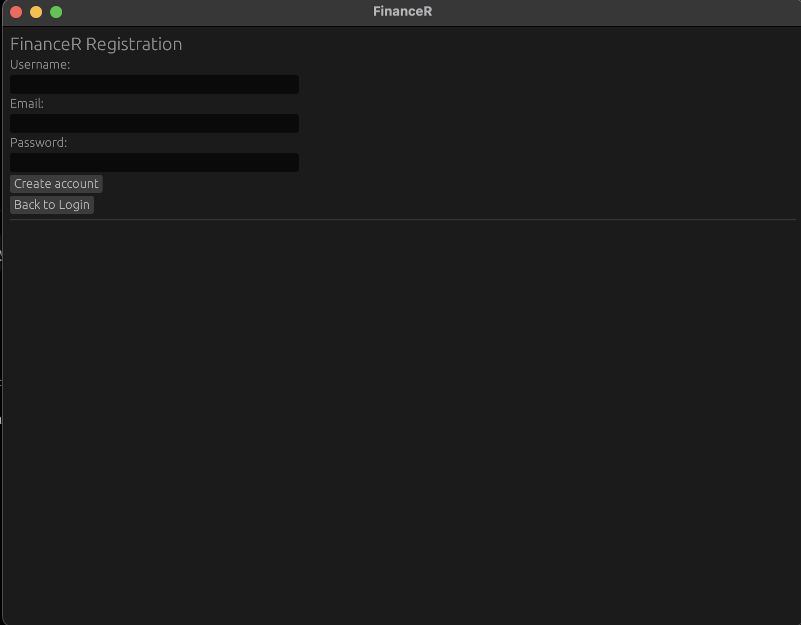
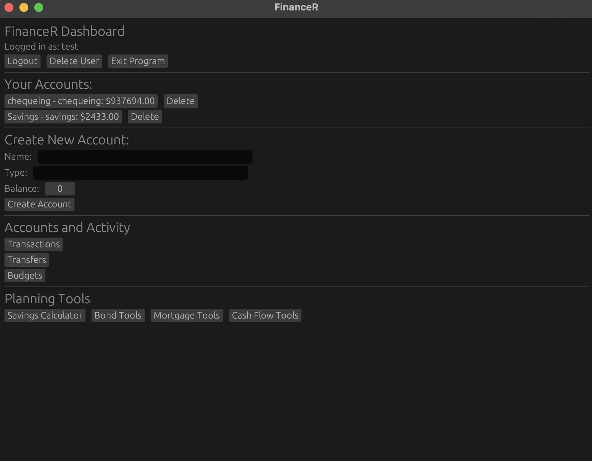
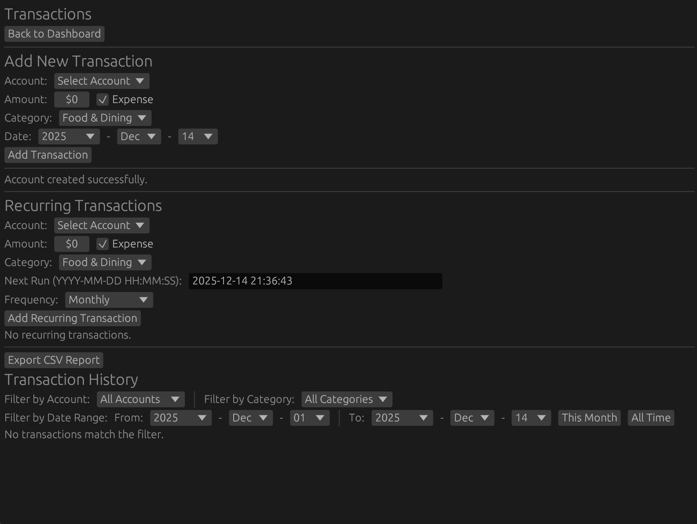
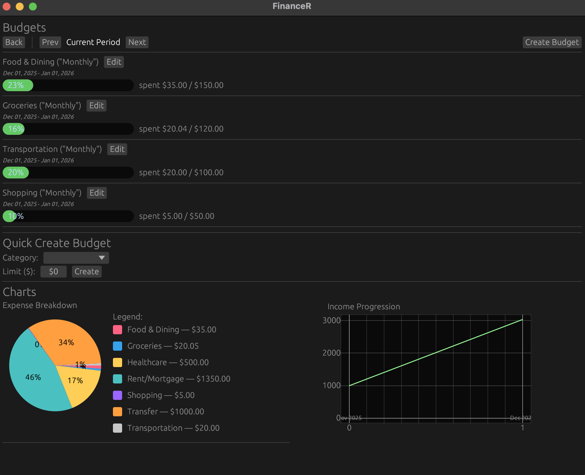
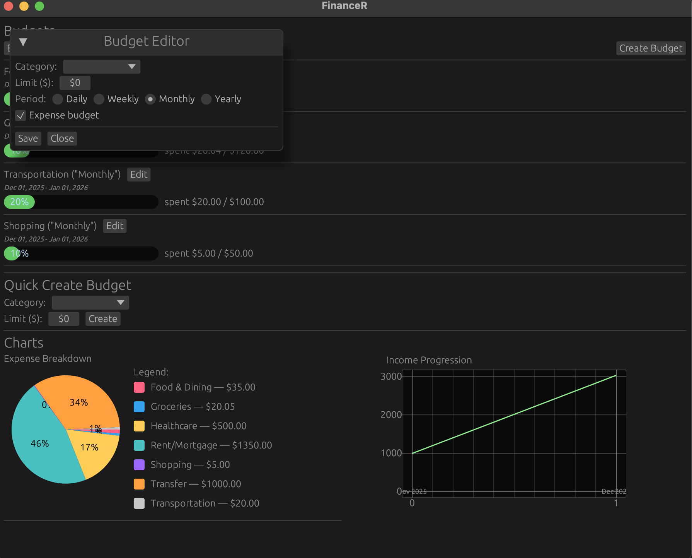
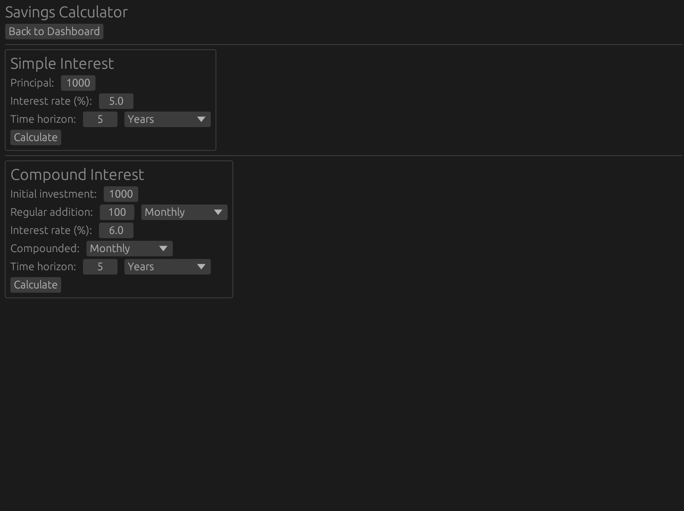
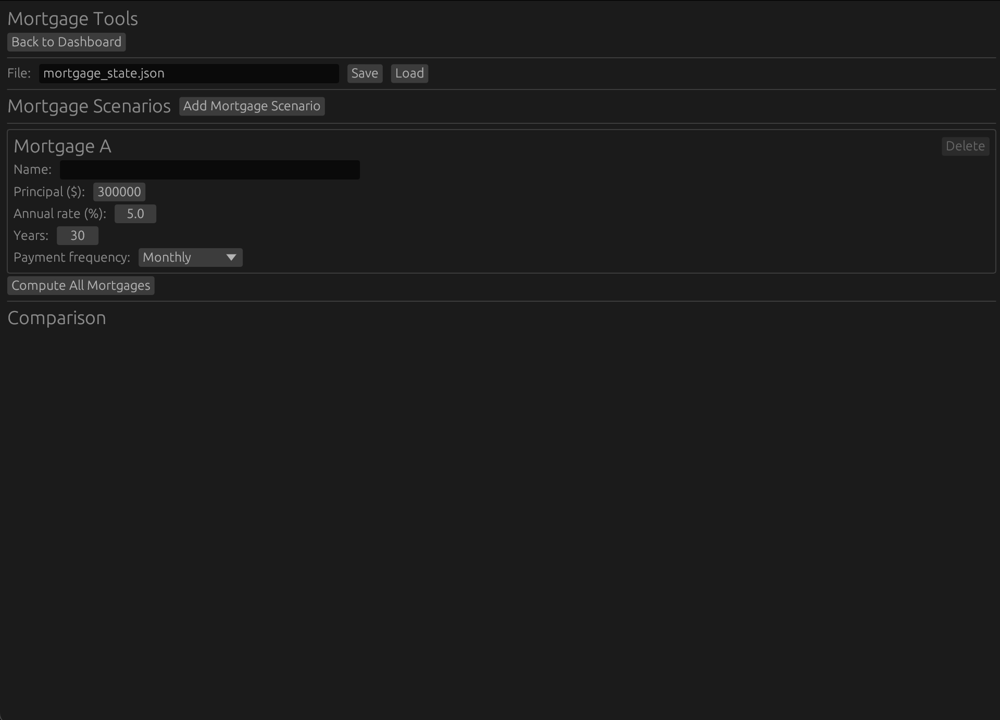
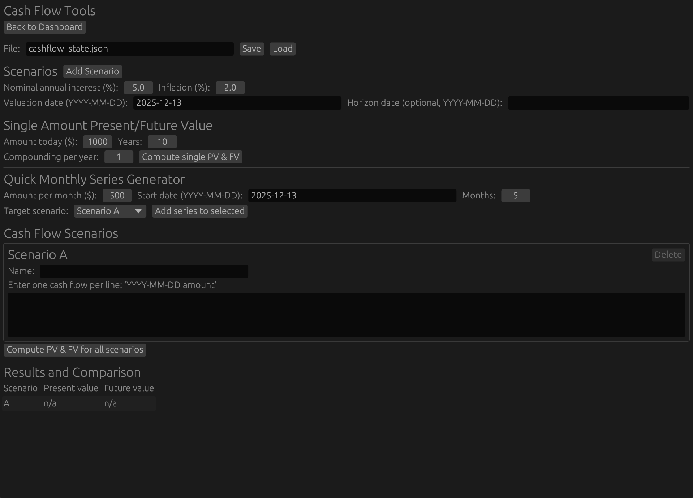

# FinanceR

# Video Slide Presentation

# Video Demo

# Final Report

## Team Members

| Name           | Student ID |
| -------------- | ---------- |
| Khantil Desai  | 1006155161 |
| Vishnu Akundi  | 1006212028 |
| Mohammad Harun | 1005235844 |

## Motivation

In the modern era where there are countless ways that businesses are trying to encourage unnecessary spending, it is more important now, than ever before for people to be equipped with the tools necessary to manage their finances. Currently there are various tools available to track personal finances but most of them are on a for-profit driven model, which require users to make one-time or recurring purchases to use the product. [1] These types of solutions are not ideal for mass adoption. To really help the most number of people improve their finances a free tool must be developed.

This is why a Rust crate would make the most sense since they are freely available and can easily be installed and used on most operating systems. The other benefit of using Rust is that Rust removes entire classes of errors such as dangling pointers, double free errors, and null pointer dereferences. These types of errors are bound to proliferate in any legacy system as they develop, however, this proposed app will be immune to it. A key limitation of existing Rust finance tracking apps is the lack of a GUI. Current implementations are limited to command line and file based I/O. [2] This is where FinanceR will fill a gap in the current ecosystem. FinanceR will implement a simple and intuitive GUI that will allow this app to be used by as many people as possible. 

## Objectives

The objective of **FinanceR** is to design and implement a secure, feature-rich, and user-friendly personal finance management application built in Rust. Unlike many Rust-based tools designed in class that have been restricted to command-line interfaces, FinanceR introduces a graphical user interface (GUI) with back-end integration, making it accessible to both technical and non-technical users.  

FinanceR provides a centralized platform for multi-user financial management, enabling users to create secure profiles with password authentication and access a consolidated view of their accounts, similar to existing online banking systems.  

Another key goal is to deliver a comprehensive income and expense tracker. Users can log transactions manually or automate recurring entries such as bills or salaries. Categories (default or custom) will provide more granular insight into spending and income patterns, allowing for visualizations.  

Finally, FinanceR will include long-term planning tools for savings and investment. Users can project growth with recurring contributions and expected returns, supported by visualizations of compounding effects.  

By combining the safety and performance of Rust with an intuitive GUI, FinanceR fills a gap in the ecosystem, emphasizing security, usability, and actionable insights to improve financial decision-making. 

## Key Features

To meet these objectives, FinanceR will implement a well-defined set of features organized into categories. Each feature is designed to be modular, ensuring that development tasks can be distributed among team members while still contributing to a cohesive final product. Each feature also adds specific value in line with the defined objectives. 

#### 1. User Authentication and Profiles

- Multi-user access: FinanceR will support multiple users, each with a unique username and password combination. Passwords and financial data will be stored securely using hashing and encryption techniques. Additionally, each user’s financial data will be isolated to maintain privacy.
- Secure login flow: Users authenticate through a graphical login interface with validation and error handling for incorrect credentials or duplicate usernames.
- Onboarding flow: First-time users will be prompted to create a profile, while returning users will log in via a clean GUI login screen. Error handling will be implemented for incorrect credentials or duplicate usernames.

Value: This feature enables FinanceR to function as a realistic personal finance application rather than a single-user prototype.


#### 2. Account Management

- Multiple account types: Users can create and manage various accounts such as checking, savings, credit cards, or custom-defined accounts.
- Dashboard view: A consolidated overview of balances across all accounts will be displayed in the GUI, mirroring the layout of a typical online banking dashboard.
- Automatic balance updates: Account balances update dynamically in response to transactions and transfers.

Value: This provides users with a consolidated overview of their finances, similar to an online banking interface.


#### 3. Transaction Management

FinanceR provides full support for recording and reviewing income and expenses.

- Income and expense logging: Users can add transactions with metadata including date, amount, category, and associated account.
- Recurring transactions: Users can define recurring expenses or income sources that will automatically update balances on a daily, weekly, or monthly basis. This ensures routine payments are tracked without manual entry.
- Editing and deletion: Transactions can be edited or removed, with balances recalculated automatically.
- Filtering and navigation: Transaction history can be filtered by account, category, and date range.
- Data export: Transaction history can be exported to CSV for external analysis or record keeping.

- Transfers between accounts: Support for internal transfers, such as moving money from checking to savings, distinct from external expenses or income.
- Categorization system: Each transaction can be tagged with one or more categories. Default categories will be provided, but users will be able to define custom categories as needed.

Value: These capabilities allow users to maintain accurate and flexible financial records. Separating transfers from expenses improves clarity and mirrors real-world banking behavior.


#### 4. Budgeting and Expense Tracking

FinanceR includes flexible budgeting tools with visual feedback.


- Category-specific budgets: Users can set spending limits for expense categories and income targets for revenue categories.
- Time-based tracking: Budgets can be defined on flexible timescales (daily, weekly, monthly, yearly).
- Budget creation options: Budgets can be created using a full budget editor or a quick-create interface.
- Progress indicators: Each budget displays a progress bar showing the proportion of the budget that has been used.
- Period navigation: Users can view previous, current, and upcoming budget periods.
- Integrated charts: Expense breakdown and income progression charts provide visual summaries tied to transaction data. A pie chart shows spending by category, while a line chart illustrates income trends over time.

Value: These features help users monitor spending behavior and adjust habits proactively.

#### 5. Savings and Investment Tools

FinanceR includes several planning tools that support scenario-based financial analysis. All planning tools allow scenarios to be saved and loaded using JSON files.

#### a) Bond Pricing Tool
- Users can define multiple bond scenarios with parameters such as coupon rate, yield to maturity, and maturity length.
- Bond prices are computed automatically based on the entered parameters.

#### b) Mortgage Calculator
- Users can define and compare multiple mortgage scenarios.
- Mortgage payments are computed using principal amount, interest rate, term length, and payment frequency.

#### c) Cash Flow Analysis Tool
- Users can create named cash-flow scenarios.
- Cash flows are entered with explicit dates and amounts, supporting both income and expenses.
- Repetitive monthly cash flows can be generated automatically using a built-in series generator.
- Present value and future value are computed for each scenario using interest and inflation assumptions.

Value: These tools extend FinanceR beyond short-term tracking into long-term financial reasoning.

  
#### 6. Reporting and Visualization

- Flexible reports: Users can generate reports based on account activity, income sources, or expense categories. Reports can be filtered by time period and granularity (daily, monthly, yearly). Reports can be exported in CSV format for external analysis by the user.
- Graphical summaries: The GUI will display pie charts for expense breakdowns and line charts for income trends.

Value: Reporting and visualization features provide actionable insights into financial behavior, enabling users to make informed decisions.

## Users Guide

### 1. Launching FinanceR

FinanceR is a desktop GUI personal finance manager with secure user accounts and a local database backend.

**To begin:**
1. Run the FinanceR application.
2. You will start on the **Login** screen.

3. Click on the **Register** button to setup as a new User.

---

### 2. Creating an Account (Registration)



On the **FinanceR Registration** screen:
1. Enter a **Username**
2. Enter an **Email**
3. Enter a **Password**
4. Click **Create account**

If the email is of a valid format, a new User will be created, and you will be taken back to the Login Screen.

**Security note:** Passwords are not stored in plain text. FinanceR stores password hashes using a secure hashing algorithm.

---

### 3. Logging In


On the **FinanceR Login** screen:
1. Enter your **Username**
2. Enter your **Password**
3. Click **Login**

If credentials are valid, you will be taken to the **Dashboard**.

---

### 4. Dashboard Overview and Navigation

The **FinanceR Dashboard** is the home screen after login.



It includes:
- **Basic Controls**: Logout, Delete User and Exit Program buttons
- **Your Accounts**: a list of existing accounts and their balances, and a button to delete an account
- **Create New Account**: create new accounts directly from the dashboard
- **Accounts and Activity**:
  - **Transactions**
  - **Transfers**
  - **Budgets**
- **Planning Tools**
  - **Savings Calculator**
  - **Bond Tools**
  - **Mortgage Tools**
  - **Cash Flow Tools**

---

### 5. Account Management

Accounts represent financial containers such as chequing or savings accounts.


**To create a new account:**
1. Enter an account **Name**
2. Enter an account **Type** (e.g., Chequing, Savings)
3. Enter an initial **Balance**
4. Click **Create Account**

The account will immediately appear in **Your Accounts**, and its balance will be tracked automatically.

---

### 6. Transactions

Open **Transactions** from the Dashboard to record income and expenses.



#### Adding a New Transaction

1. Select an **Account**
2. Enter an **Amount**
3. Toggle **Expense** if the transaction is a cost (unchecked indicates income)
4. Choose a **Category** (e.g., Food & Dining, Groceries, Income)
5. Select a **Next Run** Date and Time
6. Select a **Frequency**
7. Click **Add Recurring Transaction**

Account balances update automatically.

#### Adding a New Recurring Transaction

1. Select an **Account**
2. Enter an **Amount**
3. Toggle **Expense** if the transaction is a cost (unchecked indicates income)
4. Choose a **Category** (e.g., Food & Dining, Groceries, Income)
5. Select a **Date**
6. Click **Add Transaction**

Account balances update automatically.

#### Editing or Deleting Transactions

Each transaction in the **Transaction History** includes:
- **Edit**: modify transaction details
- **Delete**: remove the transaction and revert its effect on balances

#### Filtering Transactions

Transaction history can be filtered by:
- Account
- Category
- Date range
- Quick filters: **This Month**, **All Time**

#### Exporting Transactions

Click **Export CSV Report** to download a transaction report in CSV format.

---

### 7. Transfers

Open **Transfers** from the Dashboard to move funds between accounts.


#### Creating a Transfer

1. Select a **From Account**
2. Select a **To Account**
3. Enter an **Amount**
4. Choose a **Date**
5. Click **Execute Transfer**

Transfers update both account balances simultaneously.

#### Creating a Recurring Transfer

1. Select a **From Account**
2. Select a **To Account**
3. Enter an **Amount**
4. Choose a **Next Run** Date and Time
5. Select a **Frequency** from the menu
6. Click **Add Recurring Transfer**

Transfers update both account balances simultaneously.

#### Transfer History and Export

- View past transfers with date filtering
- Export transfer history using **Export CSV**

---

### 8. Budgets

Open **Budgets** from the Dashboard to track spending against category-based limits over configurable time periods.

FinanceR supports both **quick budget creation** and **full budget configuration** using a dedicated budget editor.



---

#### Viewing Budgets

Each existing budget displays:
- Category name
- Budget period (Daily, Weekly, Monthly, or Yearly)
- Active date range
- A progress bar showing **spent / limit**
- Percentage of budget used
- An **Edit** button

You can navigate between time periods using:
- **Prev**
- **Current Period**
- **Next**

---

#### Creating a Budget (Full Budget Editor)

Click **Create Budget** to open the **Budget Editor** dialog.



From the Budget Editor, users can:
1. Select a **Category**
2. Enter a **Spending Limit ($)**
3. Choose a **Budget Period**:
   - Daily
   - Weekly
   - Monthly
   - Yearly
4. Specify whether the budget applies to **Expenses** (expense budget toggle)
5. Click **Save** to create the budget

This method allows full control over the budget’s category, time scale, and spending constraints.

---

#### Quick Create Budget

For faster setup, the **Quick Create Budget** section allows users to:
1. Select a **Category**
2. Enter a **Limit ($)**
3. Click **Create**

Quick-created budgets use default period settings and are useful for rapid setup.

---

#### Editing Budgets

Click **Edit** next to any existing budget to reopen the **Budget Editor**, where users can:
- Change the category
- Adjust the spending limit
- Modify the budget period (daily, weekly, monthly, yearly)
- Save changes or close without saving

Updates take effect immediately and refresh budget progress indicators.

---

#### Budget Charts

The Budgets screen includes visual summaries to aid financial insight:
- **Expense Breakdown** pie chart showing spending by category
- **Income Progression** line chart illustrating income trends over the selected period


---

### 9. Planning Tools

FinanceR includes planning utilities for long-term financial projections. The Bond, Mortgage, and Cash Flow tools support saving and loading scenarios via JSON files.


---

#### 9.1 Savings Calculator

The Savings Tool allows users to project how their savings will grow.



**Workflow**
1. 

---

#### 9.2 Bond Tools

The Bond Tools allow users to price fixed-income securities.


**Workflow:**
1. Specify a JSON file name (default: `bond_state.json`)
2. Click **Load** to restore previous scenarios (optional)
3. Click **Add Bond Scenario**
4. Enter:
   - Name
   - Face value
   - Coupon rate
   - Yield to maturity
   - Years to maturity
   - Payments per year
5. Click **Price All Bonds**

Use **Save** to persist scenarios.

---

#### 9.3 Mortgage Tools

Mortgage Tools compute payments and compare mortgage scenarios.



**Workflow:**
1. Choose a JSON file (e.g., `mortgage_state.json`)
2. Load existing scenarios (optional)
3. Click **Add Mortgage Scenario**
4. Enter:
   - Name
   - Principal
   - Annual interest rate
   - Term (years)
   - Payment frequency
5. Click **Compute All Mortgages**

Scenarios can be saved and reloaded.

---

#### 9.4 Cash Flow Tools

Cash Flow Tools support present/future value calculations and multi-cash-flow scenarios.



**Inputs:**
- Nominal annual interest rate
- Inflation rate
- Valuation date
- Optional horizon date

**Single Amount Calculation:**
1. Enter amount, years, and compounding frequency
2. Click **Compute single PV & FV**

**Scenario-Based Cash Flows**

Scenario-based cash flows allow users to evaluate the present and future value of multiple cash-flow streams under a common interest and inflation model. Each scenario represents an independent financial plan (e.g., salary payments, rent expenses, investment contributions).

**Creating a Scenario**
1. Click **Add Scenario** to create a new cash-flow scenario.
2. Enter a descriptive **Scenario Name** to identify the plan.

**Entering Cash Flows**
- Cash flows are entered one per line using the format:'YYYY-MM-DD amount'
- Positive values represent incoming cash (e.g., salary or investment returns).
- Negative values represent outgoing cash (e.g., rent, expenses, loan payments).

Example:
```
2025-01-01 3000
2025-01-15 -1200
2025-02-01 3000
```

**Quick Monthly Series Generator (Optional)**
To simplify repetitive cash flows, such as monthly income or rent:
1. Enter the **Monthly Amount**
2. Specify a **Start Date**
3. Select the **Number of Months**
4. Choose the **Target Scenario**
5. Click **Add series to selected**

This automatically generates and appends a sequence of evenly spaced monthly cash flows to the selected scenario.

**Computing Present and Future Values**
Once all scenarios are defined:
1. Click **Compute PV & FV for all scenarios**
2. FinanceR discounts and compounds each cash flow using the specified:
   - Nominal annual interest rate
   - Inflation rate
   - Valuation date
3. The results table displays the **Present Value (PV)** and **Future Value (FV)** for each scenario, enabling direct comparison between alternative financial plans.


---

### 10. Common Usage Patterns

- **Expense tracking**: Add transactions and review history
- **Budget monitoring**: Set category limits and track progress
- **Account management**: Transfer funds and monitor balances
- **Financial planning**: Use bond, mortgage, and cash flow tools for projections

---

### 11. Logging Out

Click **Logout** from the Dashboard to securely end your session and return to the login screen.

---

## Reproducibility Guide

This guide describes the steps required to set up and run the application in a reproducible manner. The instructions assume a Unix-based environment (macOS or Linux) and basic familiarity with the terminal.

---

### Prerequisites

#### Supported Operating Systems

- macOS
- Linux

> **Note**  
> Windows is not supported directly.  
> If you are on Windows, please install Ubuntu Linux (or another Linux distribution) and run the following steps inside that environment.

---

### Required Tools

#### Git

Git is required to clone the repository and manage source code versions.
- Install Git by downloading it from:  
  https://git-scm.com
- Or install using Homebrew:
```bash
brew install git
```

#### Package Manager To Install System Dependencies

Homebrew is recommended to install the dependencies; however, linux users may use other package managers to install their dependencies.
```bash
brew install homebrew
```

#### Rust and Cargo

The project is written in Rust. Cargo, Rust’s package manager and build tool, is included with Rust.
```bash
brew install rust
```

Verify installation:
``` bash
rustc --version
cargo --version
```

#### SQLite3

SQLite is used as the application’s database backend.
```bash
brew install sqlite3
```

Verify installation:
``` bash
sqlite3 --version
```

### Set up Instructions

#### Step 1: Clone the repository

Clone the project repository to your local machine and navigate into the project directory.
```bash
git clone https://github.com/harunm1/Personal-Finance-Tracker.git
cd Personal-Finance-Tracker/financer
```

#### Step 2: Create the database directory

Create a directory named db in the project root (same level as src). This directory will store the SQLite database file.
```bash
mkdir db
```

#### Step 3: Create the SQLite database file
This step is optional but it is safer to create the file.
```bash
touch db/financer.db
```

#### Step 4: Create the environment file
Create a .env file in the project root directory:
```bash
touch .env
```

Add the following line to the file:
```bash
DATABASE_URL=db/financer.db
```

#### Step 5: Install Diesel CLI (SQLite)

Install the Diesel CLI with SQLite support:
```bash
cargo install diesel_cli --no-default-features --features sqlite
```

Verify installation:
```bash
diesel --version
```

Note: after installing Diesel CLI, the diesel command may not be found because Cargo’s bin directory is not in your PATH by default.  
For zsh:
```bash
echo 'export PATH="$HOME/.cargo/bin:$PATH"' >> ~/.zshrc
source ~/.zshrc
```

For bash:
```bash
echo 'export PATH="$HOME/.cargo/bin:$PATH"' >> ~/.bashrc
source ~/.bashrc
```

#### Step 6: Run database migrations

Apply the database schema using Diesel migrations:
```bash
diesel migration run
```

#### Step 7: Run application

Once all dependencies and database setup steps are complete, run the application using Cargo:
```bash
cargo run
```
##### Notes: 

All commands must be executed from the project root directory (financer)

## Team Member Contributions

### Khantil Desai
* Created the base structs for the core elements of the accounting model used in this project.
    * Created the different structs and how they interacted with each other
    * Implemented the basic functions to interact with those struct
    * Ensured those classes worked well with the Object-Relational-Model (ORM) used in the code
    * This unlocked all the work to bring the whole system together with the gui and add additional features around the accounting setup
* Developed the financial planning features
    * These features allow users to plan for different Bond, Mortgage, and Cash Flow scenarios, and were key features promised in the Proposal.
    * Developed the functions for calculating Present Value (PV) and Future Value of a Bond
    * Developed the functions for calculating PV and FV of a Cash Flow
    * Developed the functions for calculating monthly payments for Mortgages
    * Added Unit Tests for all the above functions
    * Develop the GUI for these financial Tools as 3 separate pages
* Developed the Savings Calculator feature
    * This feature allows users to calculate a simple interest scenario as well as a compounding scenario to allow them to see how their savings will grow over time. 
        * This was one of the key features promised in the proposal
    * Implemented the Simple and Compound Interest functions
    * Added tests for the Simple and Compound Interest functions
    * Created a GUI for the Savings Calculator, as a new page in the app
* Final clean up of the code and last-minute bug fixes
    * Added the feature to delete a User
    * Added the feature to delete an Account
    * Added the feature to add and delete a recurring transaction or transfer
    * Fixed the issue of parts of the Budget, and Financial Tools page not being visible by implementing a page-wide scroll functionality in the GUI

### Mohammad Harun

* Established the initial project structure and core application layout
    * Designed the foundational code organization, including separation of database logic, application logic, and data models
    * Defined common patterns and module boundaries that the rest of the team built upon
    * Provided a stable foundation that enabled parallel development across the team
* Implemented user authentication and profile management
    * Designed and implemented user registration and login functionality
    * Supported multi-user access with unique usernames and passwords
    * ntegrated secure password handling using hashing and encryption techniques
    * Implemented data validation and error handling for incorrect credentials and duplicate usernames
* Developed the onboarding and login user experience
    * Created a GUI login screen using egui
    * Ensured smooth transitions between authentication states and the main application
    * Implemented account creation and validation through the GUI
* Implemented reporting and visualization features
    * Developed report generation based on account activity, income sources, and expense categories
    * Integrated graphical summaries into the GUI, including pie charts for expense breakdowns and line charts for income trends
* Authored the Reproducibility Guide and project setup documentation
* Coordinated team communication and integration efforts
    * Organized and scheduled team meetings to track progress and resolve blockers
    * Helped resolve merge conflicts and supported smooth feature integration

## Lessons Learned and Concluding Remarks

The development of this project provided a deeply engaging and comprehensive learning experience, extending far beyond simply producing a working application. Building a personal finance tracker with a graphical user interface required careful consideration of multiple facets of software engineering, including system architecture, tooling choices, development methodology, data persistence, and team coordination. Throughout the project lifecycle, our team encountered numerous technical and organizational challenges that influenced the evolution of the system and shaped the lessons we learned. Integrating persistent storage, GUI elements, and application logic into a cohesive and maintainable system required balancing design flexibility with Rust’s strict compile-time safety guarantees, and this process reinforced the importance of deliberate planning, disciplined development practices, and thoughtful use of modern language features to achieve robust and reliable software. Reflecting on this experience highlights the value of careful architectural decisions, iterative validation, and conscious attention to maintainability, while also showcasing Rust’s strengths as a language for building high-performance and safe user-facing applications.  

One of the most significant lessons concerned our approach to testing and development methodology. Our team did not adopt test-driven development during the early stages, opting instead to implement functionality first and introduce tests retrospectively. While this approach allowed for rapid initial development, it introduced additional complexity later when validating the system’s correctness. Writing tests after the fact revealed design shortcomings, including tightly coupled components, unclear module boundaries, and untested edge cases, which required extensive refactoring to address. For example, certain state-handling functions in the GUI relied on assumptions that were not easily decoupled for testing, necessitating the creation of additional abstractions to make the tests feasible. This experience reinforced that testing is not solely a verification mechanism but also an integral part of system design, encouraging modularity, clearer interfaces, and more deliberate architectural decisions. When combined with Rust’s strong type system, ownership model, and compile-time guarantees, adopting TDD from the beginning would likely have prevented a number of these issues, improved code correctness, and reduced technical debt, enhancing confidence in both individual components and the system as a whole. 

A further lesson emerged from our experience with data modeling and database interactions. Leveraging Object-Relational Mapping to interface with a SQLite database greatly simplified the process of handling persistent data while also encouraging a clean and modular project structure. Expressing queries, schema definitions, and migrations directly in Rust reduced boilerplate code, allowed the compiler to catch errors early, and made the overall system easier to reason about. At the same time, our early decisions regarding core data models highlighted the importance of deliberate planning. Several Rust structs were initially defined to anticipate future features but ended up unused as the project evolved, necessitating the use of allow dead code annotations to suppress compiler warnings. This underscored the value of aligning planned models with actual system requirements and demonstrated that periodic review and refactoring of data structures is crucial to maintain clarity and reduce unnecessary complexity. Rust’s strict compiler feedback provided a continuous reminder of the need for intentional design and offered guidance for removing redundant abstractions, thereby reinforcing disciplined coding practices and emphasizing the balance between anticipating future needs and adhering to current functionality. 

Working with Rust’s graphical user interface ecosystem, particularly through the egui library, proved to be another area of substantial learning. While Rust is often associated with systems programming or backend development, building a GUI application revealed its suitability for interactive, user-facing software. The immediate-mode GUI paradigm of egui integrated naturally with Rust’s ownership and borrowing model, allowing clear management of application state while ensuring memory safety. Handling user interactions, updating the interface dynamically, and maintaining consistent state across multiple components required careful attention to explicit data flow and state encapsulation. This experience emphasized the versatility of Rust and its ability to support performant applications without compromising safety or maintainability. It also reinforced software design principles such as separation of concerns, predictability in state transitions, and careful handling of mutable data, demonstrating that Rust can serve as a strong foundation for both low-level and high-level application development.  

An additional lesson emerged from Rust’s ownership and borrowing system, which profoundly shaped our design choices and coding practices. Managing ownership of data structures and references, especially for GUI state updates and database interactions, initially added complexity but ultimately enforced safer and more predictable code. Rust prevented runtime errors such as use-after-free or unintended data races, which could have been common in other languages. We had to carefully handle mutable references across functions and closures, which encouraged clearer separation of responsibilities and more deliberate architectural decisions. Borrowing rules influenced function signatures, data passing, and struct design, promoting explicit state management and modularity. This lesson highlighted how Rust’s ownership model not only ensures memory safety but also acts as a design guide, shaping both the structure and quality of the software while encouraging maintainable, efficient, and robust implementations.  

Finally, the project reinforced the critical importance of effective collaboration, time management, and adaptability in team-based development. Coordinating a three-person team with varying schedules presented challenges, and inconsistent meeting availability occasionally resulted in slower decision-making and missed internal milestones. Despite these difficulties, the team adapted by improving communication, breaking down tasks into smaller, manageable increments, and prioritizing integration of individual contributions. This experience illustrated that successful software development requires not only technical skill but also careful workflow planning, realistic milestone setting, and flexibility in responding to unexpected delays. These lessons—from testing strategies and data modeling to GUI design and team coordination—highlight the comprehensive skill set required to produce maintainable, performant software.  

Looking forward, there are several areas where the project could be extended or improved to enhance functionality, performance, and maintainability. Adopting test-driven development from the outset could lead to cleaner, more modular code and reduce the risk of regressions. Refining data models and removing unused structs would simplify the codebase and make future feature expansion easier. Enhancements to the GUI could include more advanced user interactions, real-time visualizations of financial data, and improved accessibility, while performance profiling and optimization would ensure responsiveness for larger datasets. Expanding the application to support multi-platform deployment or cloud-backed synchronization could further demonstrate Rust’s versatility and prepare the system for real-world usage. Overall, these reflections demonstrate how the lessons learned, combined with Rust’s safety and performance guarantees, provide a solid foundation for future software projects.  
